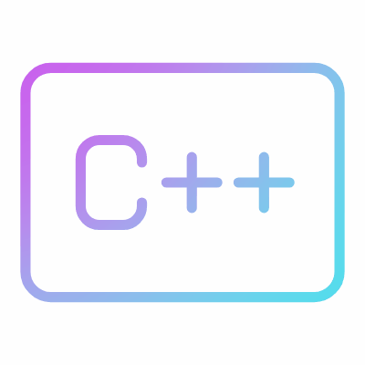

<!-- PROJECT SHIELDS -->
<!--
*** I'm using markdown "reference style" links for readability.
*** Reference links are enclosed in brackets [ ] instead of parentheses ( ).
*** See the bottom of this document for the declaration of the reference variables
*** for contributors-url, forks-url, etc. This is an optional, concise syntax you may use.
*** https://www.markdownguide.org/basic-syntax/#reference-style-links
-->
[![Contributors][contributors-shield]][contributors-url]
[![Forks][forks-shield]][forks-url]
[![Stargazers][stars-shield]][stars-url]
[![Issues][issues-shield]][issues-url]
[![MIT License][license-shield]][license-url]
[![LinkedIn][linkedin-shield]][linkedin-url]

<!-- PROJECT LOGO -->
<br />
<div align="center">
  <a href="https://github.com/bwrob/python_repo_template">
    
  </a>

<h3 align="center">LoggerLite</h3>

  <p align="center">
    Simple C++ based header-only lightweight logger library
    <br />
    <a href="https://github.com/quantinsights/LoggerLite"><strong>Explore the docs »</strong></a>
    <br />
    <br />
    <a href="https://github.com/quantinsights/LoggerLite">View Demo</a>
    ·
    <a href="https://github.com/quantinsights/LoggerLite/issues/new?labels=bug&template=bug-report---.md">Report Bug</a>
    ·
    <a href="https://github.com/quantinsights/LoggerLite/issues/new?labels=enhancement&template=feature-request---.md">Request Feature</a>
  </p>
</div>

<!-- TABLE OF CONTENTS -->
<details>
  <summary>Table of Contents</summary>
  <ol>
    <li>
      <a href="#about-the-project">About The Project</a>
      <ul>
        <li><a href="#built-with">Built With</a></li>
      </ul>
    </li>
    <li>
      <a href="#getting-started">Getting Started</a>
      <ul>
        <li><a href="#prerequisites">Prerequisites</a></li>
        <li><a href="#installation">Installation</a></li>
      </ul>
    </li>
    <li><a href="#usage">Usage</a></li>
    <li><a href="#roadmap">Roadmap</a></li>
    <li><a href="#contributing">Contributing</a></li>
    <li><a href="#license">License</a></li>
    <li><a href="#contact">Contact</a></li>
    <li><a href="#acknowledgments">Acknowledgments</a></li>
  </ol>
</details>

<!-- ABOUT THE PROJECT -->
## About The Project

### Motivation

This library is a simple header-only logger in C++. It supports a basic subset of features found in most commercial logging libraries. 

Logging is a means of tracking events when some software runs. The software developer adds logging calls to their code to indicate that certain events have occurred. An event is described by a descriptive message which can optionally contain variable data. Events also have an importance which the developer ascribes to the event; the importance can also be called the *level* or the *severity*.

### Features at a glance

- Configurable
- Thread and type safe
- Cross-platform
- Sending to syslog

### 'Logger' objects

A `Logger` exposes the interface that user-application code directly uses. Note that, `Logger` should never be directly instantiated, but an instance should be obtained using the factory method `Logger.getLogger(name)`. Multiple calls to `getLogger()` with the same name will always return a reference to the same logger object.

The `name` is potentially a period-separated hierarchical value, like `foo.bar.baz` (though it could also be just plain `foo`). Loggers that are further down the hierarchical list are children of loggers higher up in the list. For example, given a logger with a name of `foo.bar`, `foo.bar.baz` and `foo.bam` are descendants of `foo`. In addition, all loggers are descendants of the root logger. 

`Logger` objects have a 3-fold job. First, they expose several methods to the application code, so that applications can log messages at run-time. Second, logger objects determine which log messages to act upon based on the severity (the default filtering facility) or filter objects. Third, logger objects pass all relevant log messages to all interested log handlers.

There are few methods you can invoke to configure a `Logger` instance:

- `Logger.setLevel()` specifies the lowest-severity log message a logger will handle, where debug is the lowest built-in severity level and critical is the highest built-in severity. For example, if the severity level is INFO, the logger will only handle INFO, WARNING, ERROR and CRITICAL messages and will ignore DEBUG messages.
- `Logger.addHandler()` and `Logger.removeHandler()` add and remove handler objects from the logger object. 
- `Logger.addFilter()` and `Logger.removeFilter()` add and remove filter objects from the logger object. Filters are covered in more detail later ahead.

You don't always need to call these methods on every logger you create. See the last 2 paragraphs in this section.

With the logger object configured, the following methods create log messages:

- `Logger.debug()`, `Logger.info()`, `Logger.warning()`, `Logger.error()`, `Logger.critical()` all create log records with a message and a level that corresponds to their respective method names. The message is actually a format string, which may contain standard string substitution syntax of `%f`, `%d`, `%s` and so forth. The rest of their arguments is a list of objects that correspond with the substitution fields in the message.  

Loggers have a concept of *effective level*. If a level is not set explicitly on a logger, the level of its parent is used instead as its effective level. If the parent has no explicit level set, its parent is examined, and so on - all ancestors are found until an explicitly set level is found. The root logger always has an explicit level. The root logger always has an explicit level set (`WARNING` by default). When deciding whether to process an event, the effective level of the logger is used to determine whether the event is passed to the logger's handlers.

Child loggers propogate messages up to the handlers associated with their ancestor loggers. Because of this, it is unnecessary to define and configure handlers for all the loggers an application uses. It is sufficient to configure handlers for a top-level logger and create child loggers as needed. 

### `Handler` objects

Handlers send the log records (created by loggers) to the appropriate destination. They are responsible for dispatching the appropriate log messages to the handler's specified destination. `Logger` objects can add zero or more handler objects to themselves with an `addHandler()` method. As an example scenario, an application may want to send all log messages to a log file, all log messages of error or higher to `std::cout` and all messages of critical importance to an email address. This scenario requires three individual handlers where each handler is responsible for sending messages of a specific severity to a specific location.

`StreamHandler` and `FileHandler` are two simple examples of handlers.

`setFormatter()` selects a `Formatter` object for this handler to use.

`addFilter()` and `removeFilter()` respectively configure and deconfigure filter objects on handlers.

### `Filter` objects

Filters provide a finer grained facility for determining which log records to output.

### `Formatter` objects

Formatters specify the layout of the log records in the final output.

<p align="right">(<a href="#readme-top">back to top</a>)</p>

### Built With


<p align="right">(<a href="#readme-top">back to top</a>)</p>

<!-- GETTING STARTED -->
## Getting Started

This is an example of how you may give instructions on setting up your project locally.
To get a local copy up and running follow these simple example steps.

### Prerequisites

This is an example of how to list things you need to use the software and how to install them.

* npm

  ```sh
  npm install npm@latest -g
  ```

### Installation

1. Get a free API Key at [https://example.com](https://example.com)
2. Clone the repo

   ```sh
   git clone https://github.com/bwrob/python_repo_template.git
   ```

3. Install NPM packages

   ```sh
   npm install
   ```

4. Enter your API in `config.js`

   ```js
   const API_KEY = 'ENTER YOUR API';
   ```

5. Change git remote url to avoid accidental pushes to base project

   ```sh
   git remote set-url origin bwrob/python_repo_template
   git remote -v # confirm the changes
   ```

<p align="right">(<a href="#readme-top">back to top</a>)</p>

<!-- USAGE EXAMPLES -->
## Usage

Use this space to show useful examples of how a project can be used. Additional screenshots, code examples and demos work well in this space. You may also link to more resources.

_For more examples, please refer to the [Documentation](https://example.com)_

<p align="right">(<a href="#readme-top">back to top</a>)</p>

<!-- ROADMAP -->
## Roadmap

* [x] Create readme
* [ ] Feature 2
* [ ] Feature 3
  * [ ] Nested Feature

See the [open issues](https://github.com/bwrob/python_repo_template/issues) for a full list of proposed features (and known issues).

<p align="right">(<a href="#readme-top">back to top</a>)</p>

<!-- CONTRIBUTING -->
## Contributing

Contributions are what make the open source community such an amazing place to learn, inspire, and create. Any contributions you make are **greatly appreciated**.

If you have a suggestion that would make this better, please fork the repo and create a pull request. You can also simply open an issue with the tag "enhancement".
Don't forget to give the project a star! Thanks again!

1. Fork the Project
2. Create your Feature Branch (`git checkout -b feature/AmazingFeature`)
3. Commit your Changes (`git commit -m 'Add some AmazingFeature'`)
4. Push to the Branch (`git push origin feature/AmazingFeature`)
5. Open a Pull Request

<p align="right">(<a href="#readme-top">back to top</a>)</p>

### Top contributors

<a href="https://github.com/bwrob/python_repo_template/graphs/contributors">
  
</a>

<!-- LICENSE -->
## License

Distributed under the MIT License. See `LICENSE.txt` for more information.

<p align="right">(<a href="#readme-top">back to top</a>)</p>

<!-- CONTACT -->
## Contact

Your Name - <email@email_client.com>

Project Link: [https://github.com/bwrob/python_repo_template](https://github.com/bwrob/python_repo_template)

<p align="right">(<a href="#readme-top">back to top</a>)</p>

<!-- ACKNOWLEDGMENTS -->
## Acknowledgments

* [Best-README-Template](https://github.com/othneildrew/Best-README-Template)
* []()
* []()

<p align="right">(<a href="#readme-top">back to top</a>)</p>

<!-- MARKDOWN LINKS & IMAGES -->
<!-- https://www.markdownguide.org/basic-syntax/#reference-style-links -->
[contributors-shield]: https://img.shields.io/github/contributors/bwrob/python_repo_template.svg?style=for-the-badge
[contributors-url]: https://github.com/bwrob/python_repo_template/graphs/contributors
[forks-shield]: https://img.shields.io/github/forks/bwrob/python_repo_template.svg?style=for-the-badge
[forks-url]: https://github.com/bwrob/python_repo_template/network/members
[stars-shield]: https://img.shields.io/github/stars/bwrob/python_repo_template.svg?style=for-the-badge
[stars-url]: https://github.com/bwrob/python_repo_template/stargazers
[issues-shield]: https://img.shields.io/github/issues/bwrob/python_repo_template.svg?style=for-the-badge
[issues-url]: https://github.com/bwrob/python_repo_template/issues
[license-shield]: https://img.shields.io/github/license/bwrob/python_repo_template.svg?style=for-the-badge
[license-url]: https://github.com/bwrob/python_repo_template/blob/master/LICENSE.txt
[linkedin-shield]: https://img.shields.io/badge/-LinkedIn-black.svg?style=for-the-badge&logo=linkedin&colorB=555
[linkedin-url]: https://linkedin.com/in/bartoszmwroblewski
[product-screenshot]: images/screenshot.png
[Next.js]: https://img.shields.io/badge/next.js-000000?style=for-the-badge&logo=nextdotjs&logoColor=white
[Next-url]: https://nextjs.org/
[React.js]: https://img.shields.io/badge/React-20232A?style=for-the-badge&logo=react&logoColor=61DAFB
[React-url]: https://reactjs.org/
[Vue.js]: https://img.shields.io/badge/Vue.js-35495E?style=for-the-badge&logo=vuedotjs&logoColor=4FC08D
[Vue-url]: https://vuejs.org/
[Angular.io]: https://img.shields.io/badge/Angular-DD0031?style=for-the-badge&logo=angular&logoColor=white
[Angular-url]: https://angular.io/
[Svelte.dev]: https://img.shields.io/badge/Svelte-4A4A55?style=for-the-badge&logo=svelte&logoColor=FF3E00
[Svelte-url]: https://svelte.dev/
[Laravel.com]: https://img.shields.io/badge/Laravel-FF2D20?style=for-the-badge&logo=laravel&logoColor=white
[Laravel-url]: https://laravel.com
[Bootstrap.com]: https://img.shields.io/badge/Bootstrap-563D7C?style=for-the-badge&logo=bootstrap&logoColor=white
[Bootstrap-url]: https://getbootstrap.com
[JQuery.com]: https://img.shields.io/badge/jQuery-0769AD?style=for-the-badge&logo=jquery&logoColor=white
[JQuery-url]: https://jquery.com
